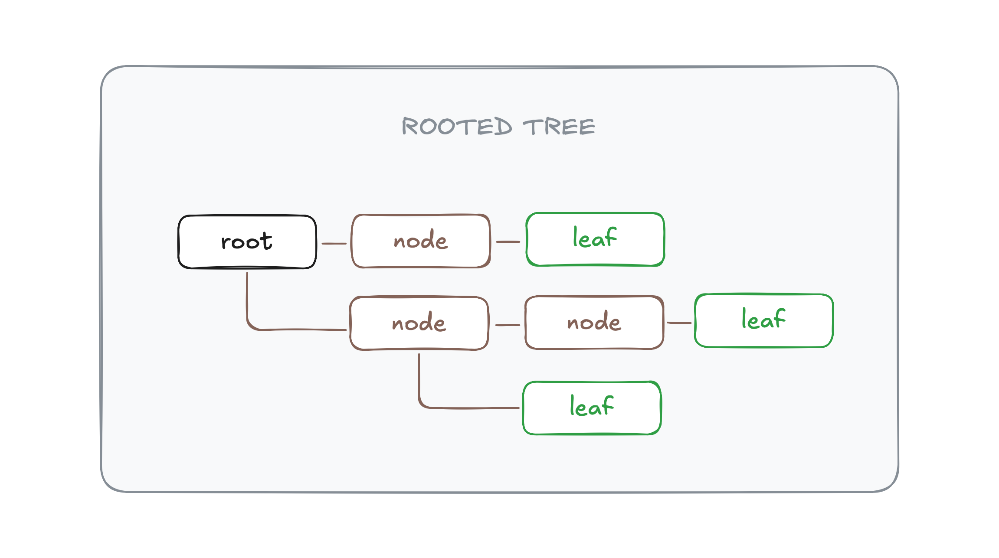
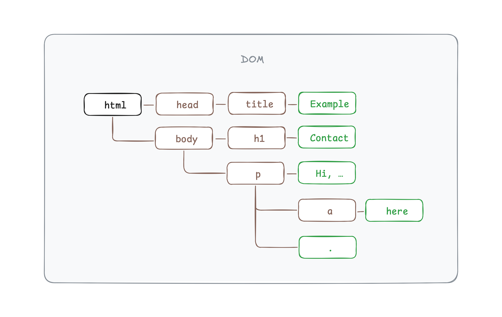

# Document Object Model

When you open a web page, your browser **parses** the page's HTML text.
It builds up a model of the document's structure and uses this model to
draw the page on the screen. This representation is called the
**Document Object Model**, or **DOM** for short. It acts as a _live_
data structure: when it's modified, the page on the screen is updated to
reflect the changes.

The DOM is a specific kind of data structure called a **tree**. A tree
is a graph with a branching structure, no cycles (a node may not contain
itself, directly or indirectly), and a single, well-defined root. In
graph theory, a **node** (or vertex) refers to a fundamental unit of the
graph. A **leaf** is a node without children, and a **root** is a node
without parents. Nodes are connected to each other by paths called
**edges**.



Trees come up a lot in computer science. In addition to representing
recursive structures such as HTML documents or programs, they are often
used to maintain sorted sets of data because elements can usually be
found or inserted more efficiently in a tree than in a flat array.

A typical tree has different kinds of nodes. The DOM includes **element
nodes**, which represent HTML elements and determine the structure of
the document. Element nodes can have child nodes. Some of these children
can be leaf nodes, such as pieces of text or comment nodes.

Consider for instance the following HTML document:

```html
<html>
    <head>
        <title>Example</title>
    </head>
    <body>
        <h1>Contact</h1>
        <p>
            Hi, my name is Bob and you can contact me
            <a href="/contact">here</a>
            .
        </p>
    </body>
</html>
```

Here is how it gets parsed into a tree by the browser:



DOM nodes are JavaScript objects that you can access through the global
`document` identifier. The `documentElement` property of `document`, for
example, is an object that represents the document's root node, which is
always the `<html>` element:

```ts
const root = document.documentElement;
console.log(root); // => <html>
```

When you print a DOM node in the browser's console, it resembles an HTML
tag. But nodes are _not_ tags, _nor_ are they strings. We can see that
they are objects with the `typeof` operator:

```ts
console.log(typeof root); // => "object"
```

Every node has a `parentNode` property that points to its parent node.
Likewise, every element node has a `childNodes` property that points to
a `NodeList` collection holding its children:

```ts
console.log(root.childNodes); // => NodeList [<head>, #text "\n", <body>]

const head = root.childNodes[0];
console.log(head); // => <head>
console.log(head.parentNode); // => <html>
```

> [!NOTE]\
> Methods that are specific to arrays such as `slice` and `includes` are
> not available on `NodeList` objects. You can convert a `NodeList`
> object to an array with the `Array.from` method.

The `childNodes` property includes text and comment nodes. In our HTML
document, there's a line break between the closing tag of `<head>` and
the opening tag of `<body>`. This line break is displayed with the
escape sequence `\n`, and is considered by the browser as a text child
node of `<html>`.

The `children` property is similar to `childNodes`, but only includes
element nodes. This can be useful when you aren't interested in text
nodes.

```ts
console.log(root.children); // => NodeList [<head>, <body>]
```

Every element node also has `firstChild`, `lastChild`, `previousSibling`
and `nextSibling` properties. The `firstChild` and `lastChild`
properties point to the first and last child elements or have the value
`null` for nodes without children. Similarly, `previousSibling` and
`nextSibling` point to adjacent nodes, which are nodes with the same
parent that appear immediately before or after the node itself. For a
first child, `previousSibling` will be `null`, and for a last child,
`nextSibling` will be `null`.

Navigating these links among parents, children, and siblings is often
useful, but if we want to find a specific node in the document, reaching
it by starting at `document.body` and following a fixed path of
properties is a bad idea. Doing so bakes assumptions into our program
about the precise structure of the document — a structure you might want
to change later. Another complicating factor is that text nodes are
created even for the white space between nodes. The example document's
`<body>` node has not just three children (`<h1>` and two `<p>`
elements), but seven: those three, plus the spaces before, after, and
between them.

If we want to get the `<a>` element in that document, we don't want to
say something like "Get the second child of the sixth child of the
document body". It'd be better if we could say "Get the first anchor in
the document". We can do so with the `querySelector` method.

```ts
const a = document.querySelector("a");
console.log(a); // => <a>
```

Every element node has a `querySelector` method that allows you to
search its descendent nodes for the element that corresponds to the
given [CSS selector]. It returns a reference to the first element that
matches the selector, or `null` if no element is found. The
`querySelectorAll` method works similarly, but returns a `NodeList`
object that contains all the elements matching the selector.

```ts
const bodyChildren = document.body.querySelectorAll("body > *");
console.log(bodyChildren); // => NodeList [<h1>, <p>]
```

JavaScript includes other methods for finding elements in the DOM, but
`querySelector` and `querySelectorAll` are sufficient most of the time.

[CSS selector]: https://developer.mozilla.org/en-US/docs/Web/CSS/CSS_selectors/Selectors_and_combinators
